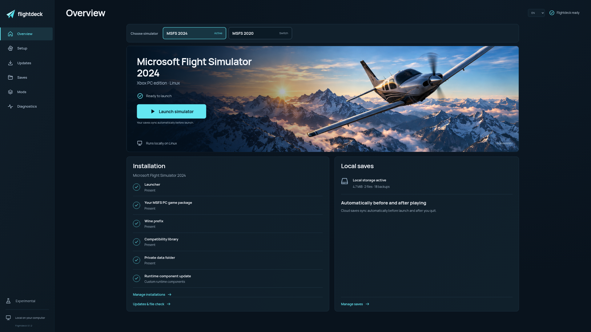

<p align="center">
  
</p>
<h1 align="center">Flightdeck</h1>
<p align="center">
  A Linux launcher for the Xbox PC editions of Microsoft Flight Simulator 2024 and 2020.
</p>
<p align="center">
  <a href="#get-started"><strong>Get started</strong></a> &nbsp;·&nbsp;
  <a href="docs/addons.md">Add-ons</a> &nbsp;·&nbsp;
  <a href="docs/vr.md">VR</a> &nbsp;·&nbsp;
  <a href="docs/game-updates.md">Game updates</a> &nbsp;·&nbsp;
  <a href="docs/known-issues.md">Known issues</a> &nbsp;·&nbsp;
  <a href="docs/changelog.md">Changes</a> &nbsp;·&nbsp;
  <a href="BUILDING.md">Build from source</a> &nbsp;·&nbsp;
  <a href="docs/readme.de.md">Deutsch</a>
</p>


Flightdeck installs and launches your **purchased Xbox PC / Microsoft Store copy
of MSFS 2024 or 2020** on your Linux computer through Wine/Proton. Sign in with your
Microsoft account, download the game and start it from one application.

**Current stable release: [Flightdeck 0.1.22](https://github.com/marselnenaj/flightdeck-msfs-2024-linux-xbox/releases/tag/v0.1.22).**
Update through **Updates → Flightdeck** or use the full installer.
The **0.2.0-dev.1 development branch** now uses a Rust backend, installer and
runtime helpers. Its native package runs without Python. This change is not yet
published; see [native status](docs/rust-migration.md) and [build instructions](BUILDING.md).
The **0.1.22 transition update** prepares the move to Rust through the existing
updater, preserving the current installation. Older versions receive 0.1.22
first, even after a stable native release becomes available; after restarting,
0.1.22 can discover that next update. See the [staged release procedure](docs/rust-transition.md).
**New in 0.1.20:** Proton switching with retained add-ons and matched Fenix patches for Experimental and CachyOS. [Changes](docs/changelog.md#0120--3-october-2026).

**0.1.18** adds optional VR setup for WiVRn, SteamVR and Monado, headset checks,
and the missing Wine/OpenXR startup integration for AMD and NVIDIA.
Enable it under **Setup → Virtual Reality**. Stereo D3D11/D3D12 frames have been
validated on AMD with a simulated headset; physical headsets, NVIDIA hardware
and an MSFS VR flight remain unverified. [VR setup and scope](docs/vr.md).

**0.1.16** fixes Microsoft sign-in failing with code 74 when a token response
also contains a required verification step. Flightdeck now opens that step and
completes verification before saving the login. Additional SOAP response fixes
and distinct processing codes make remaining failures easier to identify.
Update and restart Flightdeck before retrying sign-in.

**0.1.13** fixes Marketplace product queries failing when Microsoft returns a
fallback translation for the selected Store region. Available German text stays
preferred with German language settings; region and pricing are preserved.
Reports now identify unsupported product-mapping details, and the Store check
clearly states that it does not test in-game Marketplace product queries.
The reported Marketplace error still requires confirmation in the affected game session.

**0.1.12** corrects update/restart verification of larger, newly introduced
runtime libraries. If an older launcher reports that the installed version
could not be identified after updating, close and reopen Flightdeck once.
The NVIDIA and Store components are unchanged from 0.1.11.

**0.1.11** makes NVIDIA compatibility the automatic default and corrects DXVK's
ignored Low Latency opt-out, covering both DirectX 11 and 12. DLSS, Reflex and
NVIDIA Frame Generation are disabled by default; **NVIDIA features (experimental)**
remains selectable. The black main view still needs confirmation on NVIDIA hardware.
The Store-component update correction from 0.1.10 is included.
See [cloud saves](docs/cloud-saves.md), [Marketplace scope](docs/marketplace-collections.md)
and the [release history](docs/changelog.md).

**Experimental.** MSFS 2024 has been tested on Linux, including cockpit access
and takeoff. NVIDIA rendering and stability still require hardware validation;
results can vary by driver and GPU. MSFS 2020 startup and complete-flight
compatibility remain unconfirmed. Automatic Xbox cloud saves are experimental.
[Compatibility and limitations](#compatibility)

**Known issues:** some NVIDIA users report a black main 3D view with working
menus. Repeated cloud-sync failures and a blocking “Marketplace session expired”
message also remain reported. These issues are not confirmed fixed.
If Microsoft sign-in still fails on 0.1.16, include the displayed error code
and Flightdeck version in your report.
[Current status and scope](docs/known-issues.md).

**NVIDIA renderer correction (0.1.17, included in 0.1.19):** the 3D-texture
layout correction passes an isolated Vulkan regression check. A tester confirmed
the corrected build loads in 0.1.18, but their NVIDIA main view remains black.
The current release is available through **Updates → Flightdeck**.
[Details and validation](docs/nvidia-renderer.md#3d-texture-layout-correction-0117).

**Available in 0.1.19:** experimental GSX Pro setup for MSFS 2024, with an official
FSDT installer workflow under Mods. Installer preparation has been tested under
Wine; GSX operation in the simulator is unverified.
[GSX setup and scope](docs/addons.md#gsx-pro-experimental).

## Get started

**1. Install Flightdeck**

Get **Flightdeck-Linux-x86_64.tar.gz** from the
[releases page](https://github.com/marselnenaj/flightdeck-msfs-2024-linux-xbox/releases),
extract it and double-click **Install Flightdeck.desktop**. Your file manager
may ask you to trust this local launcher.

**2. Install your game**

Choose **Install MSFS**, select 2024 or 2020, check the destination and select **Sign in & install**.
Use the Microsoft account that owns the PC edition. Flightdeck prepares the
Wine environment, downloads the licensed game through Xodus and connects it to
the launcher.

**3. Start from your application menu**

Open **Flightdeck** and launch MSFS. The local background service starts
automatically. You do not need to start a server or leave a terminal open.
Choose **MSFS 2024** or **MSFS 2020** on the overview to switch directly
between prepared editions. If one is missing, its button opens setup.
Each edition keeps its own runtime, Wine prefix, updates and local saves.

Windows, the Xbox app, Microsoft Store and a previous MSFS installation are
not required. Your purchased PC license and an Internet connection are required.

<details>
<summary><strong>System requirements and other installation options</strong></summary>

The binary packages target Linux x86-64 with **glibc 2.39+**, Vulkan graphics
drivers and a graphical desktop with a Linux Secret
Service keyring. GTK 3, WebKitGTK 4.1, OpenSSL 3 and the GStreamer Good/Bad/Libav
media plugins are required. Allow at least **100 GiB free** for a first install;
an update or repair also keeps the previous game package.
The published 0.1.22 launcher also requires Python 3.10.12+; the native
0.2.0 development package does not. Its optional graphical installer uses
Zenity or KDialog.

Arch Linux has been tested. Other distributions need compatible libraries and
remain unverified. Setup reports missing prerequisites before installation.
Install any missing system packages through your distribution's software manager.
Chromium provides the application window when available; the default browser
is the fallback.

- [Installation details](docs/install.md)
- [Connect an existing prepared runtime](docs/runtime.md)
- [Build your own components](BUILDING.md)

`./install.sh` performs the same user-local installation from a terminal. Run
it from a newer extracted package to update Flightdeck. Opening the
updated launcher also refreshes recognized managed runtime components while the
game and setup are idle. Custom component sets and launch scripts are preserved.
[Launcher and runtime updates](docs/install.md#update-and-rollback) are separate
from downloading the game or installing the optional Fenix patch.
`flightdeck --rollback`
restores the previous **launcher**; `flightdeck --uninstall` removes its managed
files while preserving the runtime, settings and saves. No `sudo` is needed.
Installing missing Linux system packages may require administrator rights.

</details>

## In the launcher



<sub>Flightdeck 0.1.2 overview with simulator selection, shown in English.</sub>

| Area | What you can do |
| :--- | :--- |
| **Install** | Sign in, choose a destination and download your purchased PC edition, with received MB/GB and percentage when the total is known. |
| **Simulator selection** | Switch between separate MSFS 2024 and MSFS 2020 installations from the overview. |
| **Pause & resume** | Keep completed, verified download files and resume the active installation session. |
| **Game updates** | Compare the installed Store package with the current release, then download and activate a checked version. Keep the previous version for rollback. |
| **Verify & repair** | Check game files against the original download checksums. Prepare a full repair when files are missing or damaged, including at the same game version. |
| **Mods** | Open the real Community folder and see installed package names, versions and creators. |
| **Fenix A320** | Download the pinned Linux patch, run your official Fenix installer, configure cockpit displays and open the livery manager. MSFS 2024 only. |
| **Local saves** | Keep local save data and create backups while the simulator is stopped. |
| **Xbox cloud saves** | Use the cloud state before play and upload changes after exit, with local backups and conflict recovery. Experimental. |
| **Diagnostics** | Export selected checks without raw game logs, account tokens or save contents. Prepare [email problem reports](docs/problem-reports.md) with diagnostics in the message body. |
| **Deutsch / English** | Switch the interface language; installer and command-line localization are available too. |

Flightdeck 0.1.7 adds **Diagnostics → Check Store**, a purchase-free
check of sign-in, catalog, licensing, library and local window display. Reports
include Store event order and the native files recorded at game launch. See
[Store diagnostics and scope](docs/marketplace-collections.md#check-store-without-a-purchase).
The purchase dialog also reports connection and loading failures. Its display
has been checked in MSFS 2024; completed purchases and delivery of purchased
content remain unverified.

Pausing may restart up to four unfinished files. Download recovery after a
service or system restart is not implemented. Updates download the full Store
base-game package; additional content remains managed by MSFS and each add-on's
own installer. [Download behavior](docs/download-pause.md) ·
[Updates, verification and repair](docs/game-updates.md)

The download total covers the Store base-game files. For MSFS 1.8.16.0 these
totalled about **9.9 GB**; other versions may differ. Wine/Proton, additional
content downloaded inside MSFS, caches and add-ons need separate space. The
simulator runs locally while MSFS streams additional content as needed. Keep the
**100 GiB free-space requirement** even when the progress bar shows a smaller
download. [Download size and storage](docs/install.md#download-size-and-storage)

File verification requires a complete index from a successful Flightdeck
download. Older installations without this index need a full repair first.
Repair downloads the complete available base package and retains the previous
installation; it does not replace your separate Community folder or saves.

## Compatibility

| Area | Current evidence |
| :--- | :--- |
| **MSFS 2024 simulator** | Cockpit access and takeoff tested on Linux with AMD graphics. Full-flight coverage is incomplete. |
| **NVIDIA graphics** | Automatic graphics setup and selectable compatibility mode. NVIDIA rendering and flight stability require hardware validation. [Setup and limitations](docs/graphics.md) |
| **MSFS 2020 simulator** | Installation, updates and license checks are implemented. A startup disc prompt can occur; successful startup and complete-flight compatibility remain unconfirmed. |
| **Local saves** | Persistence across restarts and local backup tested. |
| **Free Store content** | Free-content downloads succeeded in a user test. |
| **Owned Marketplace content** | Account-owned add-ons can be enumerated and supported Durable licenses use genuine signed grants. Full DLC coverage and the MSFS 2024 Aviator Upgrade remain unverified. [Scope](docs/marketplace-collections.md) |
| **Marketplace purchases** | Microsoft's confirmation dialog opens and its display has been checked in MSFS 2024. Completed purchases and delivery of purchased content remain unverified. Device-shared DLC rights remain unsupported. [Scope](docs/marketplace-collections.md#purchase-dialog) |
| **Multiplayer** | Online multiplayer reported working on Linux. Group invitations still need separate testing. |
| **Xbox cloud saves** | Automatic start/exit sync, local backups and conflict recovery implemented. Native cloud read/write tested; cross-device gameplay verification remains pending. [Details](docs/cloud-saves.md) |
| **FlyByWire A32NX** | MSFS 2024 Stable 2024.1.0 installed and recognized. In-game flight test remains open. |
| **SimBridge** | HTTP health, Web MCDU, WebSocket and terrain initialization tested under Wine. Simulator connection remains unverified. |
| **Fenix A320** | Optional installer with Wine fixes, CPU displays, Legacy readouts and restore. Cockpit rendering verified with 2.4.0.4720; full-flight testing pending. See [Fenix setup](docs/addons.md#fenix-a320). |

Installation, download pause/resume and file verification have been tested on
Arch Linux. Other distributions and a fresh operating-system installation need
separate validation. A mod-list entry confirms installed files; it does not
confirm activation or working aircraft systems.

[Add-on installation guide](docs/addons.md) ·
[Marketplace scope](docs/marketplace-collections.md) ·
[Multiplayer test steps](docs/multiplayer.md)

## Local by design

The stable launcher uses Python; the native development build uses Rust. Both
serve local HTML, CSS and JavaScript and listen only on loopback. Local-origin checks and a per-session token
protect actions. There is no telemetry or CDN dependency in the launcher.
Microsoft sign-in, downloads and the simulator's online content still use their
respective network services.

Runtime files, credentials, saves and logs stay outside the source and release
archives. The interface can show installation paths locally; review screenshots
before sharing them. Closing Flightdeck leaves an already running simulator
alone.

## Documentation and development

| Guide | Covers |
| :--- | :--- |
| [Install](docs/install.md) | Requirements, setup and launcher maintenance |
| [Changes](docs/changelog.md) | Release history |
| [Known issues](docs/known-issues.md) · [Deutsch](docs/known-issues.de.md) | NVIDIA black main view, cloud-sync failures and Marketplace session errors |
| [NVIDIA graphics](docs/graphics.md) · [Deutsch](docs/graphics.de.md) | Driver requirements, graphics modes and troubleshooting |
| [Cloud saves](docs/cloud-saves.md) · [Deutsch](docs/cloud-saves.de.md) | Automatic sync, conflict recovery, backups and current limits |
| [Game maintenance](docs/game-updates.md) | Updates, file verification, full repair and rollback |
| [Add-ons](docs/addons.md) · [Deutsch](docs/addons.de.md) | Community packages, FlyByWire, SimBridge and Fenix |
| [Languages](docs/localization.md) | Interface, installer and command-line languages |
| [Build](BUILDING.md) | Native components and corresponding sources |
| [Contribute](docs/contributing.md) | Development and useful bug reports |

<details>
<summary><strong>Run the checks locally</strong></summary>

```sh
cargo build --locked
cargo test --locked
cargo fmt --all -- --check
cargo clippy --locked --all-targets -- -D warnings
python3 scripts/check-rust-parity.py --binary target/debug/flightdeck-rust
python3 scripts/check-rust-http.py --binary target/debug/flightdeck-rust
python3 -m unittest discover -s tests -p 'test_*.py' -v
python3 -m unittest discover -s tests/compat -p 'test_*.py' -v
node --test ui/tests/*.test.mjs
FLIGHTDECK_TEST_BINARY=target/debug/flightdeck-rust node ui/tests/browser-test.mjs
python3 scripts/check-source-export.py
```

The browser suite needs Chromium. HTTP and browser tests bind temporary local
sockets and use isolated fixtures, not your account or live game. Native
compatibility checks require the toolchain described in [BUILDING.md](BUILDING.md).
For a foreground development service, use `target/debug/flightdeck-rust --no-browser`.
The Python implementation remains a test reference; native packages contain no
Python application code.

</details>

## License

The launcher, UI and new integration tooling use the [MIT license](LICENSE).
Xodus retains GPL-3.0-only; Wine/GDK-derived components retain LGPL-2.1-or-later.
Native packages include dependency notices and complete corresponding sources;
the separately downloaded runner retains its own licenses. The bundled Manrope
font uses the SIL Open Font License 1.1.

[Third-party notices](compat/THIRD_PARTY_NOTICES.md) ·
[Native package provenance](docs/binary-release.md) ·
[Artwork provenance](docs/artwork.md)

Flightdeck is an independent project, not endorsed by Microsoft, Xbox, Asobo or
the upstream projects. It distributes no MSFS files, paid add-ons, proprietary
SDK headers, account credentials or game licenses. The cover is original
Flightdeck artwork, not a simulator screenshot.
