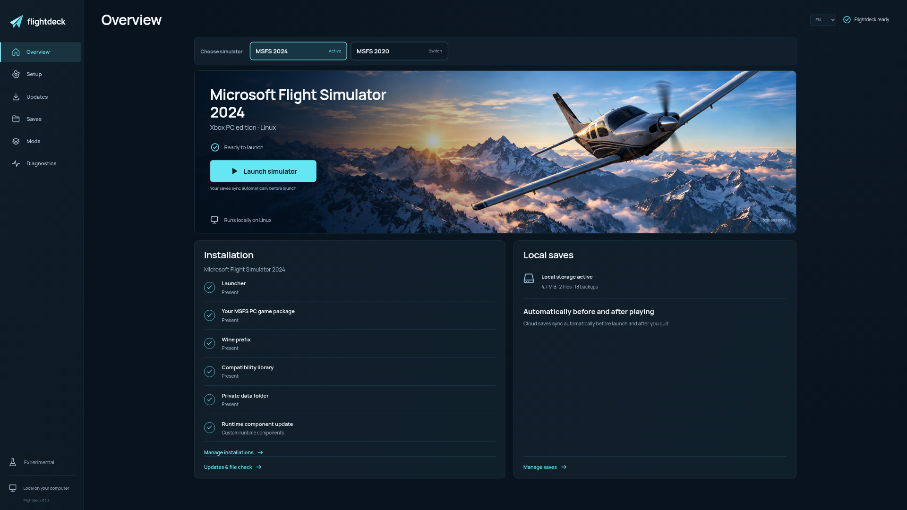

  

<h1 align="center">Flightdeck</h1>

  Ein Linux-Launcher für die Xbox-PC-Versionen von Microsoft Flight Simulator 2024 und 2020.

  <a href="#loslegen"><strong>Loslegen</strong></a> &nbsp;·&nbsp;
  <a href="addons.de.md">Mods installieren</a> &nbsp;·&nbsp;
  <a href="game-updates.md">Spielupdates</a> &nbsp;·&nbsp;
  <a href="changelog.md">Änderungen</a> &nbsp;·&nbsp;
  <a href="../BUILDING.md">Selbst bauen</a> &nbsp;·&nbsp;
  <a href="../README.md">English</a>

Flightdeck installiert und startet deine **gekaufte Xbox-PC-/Microsoft-Store-
Version von MSFS 2024 oder 2020** unter Linux mit Wine/Proton. Mit dem Microsoft-Konto
anmelden, das Spiel herunterladen und im Launcher starten.

**Flightdeck 0.1.2** ergänzt **Fenix beenden** in der geführten Fenix-Einrichtung.
Die Simulatorauswahl und verwalteten Runtime-Komponentenupdates aus 0.1.1 sind
enthalten. Zum Aktualisieren den
[vollständigen Installer](https://github.com/marselnenaj/flightdeck-msfs-2024-linux-xbox/releases/tag/v0.1.2)
verwenden. Der optionale Fenix-Patch wird über **Mods → Fenix A320** geladen.
[Alle Änderungen](changelog.md).

**Experimentell.** Für MSFS 2024 wurden der lokale Spielstart und ein
kontrollierter Start mit einem Flugzeug beobachtet. Online-Multiplayer wurde
unter Linux als funktionierend bestätigt. Für MSFS 2020 gibt es synthetische
Ablauftests und echte Lizenz-/Paketprüfungen. Bei einem Startversuch wurde eine
Datenträgeraufforderung gemeldet; eine vollständige Installation und ein Flug
sind noch nicht bestätigt. Der automatische
Abgleich von Xbox-Cloud-Spielständen ist experimentell.

## Loslegen

**1. Flightdeck installieren**

**Flightdeck-Linux-x86_64.tar.gz** auf der
[Release-Seite](https://github.com/marselnenaj/flightdeck-msfs-2024-linux-xbox/releases)
herunterladen, entpacken und **Install Flightdeck.desktop** doppelklicken. Der
Dateimanager kann verlangen, diesen lokalen Starter als vertrauenswürdig zu
markieren.

**2. MSFS herunterladen**

**MSFS installieren** und 2024 oder 2020 wählen, den Zielordner prüfen und mit dem Microsoft-Konto
anmelden, das die PC-Version besitzt. Flightdeck bereitet die Wine-Umgebung vor,
lädt das lizenzierte Spiel über Xodus und verbindet die fertige Installation.
Die Microsoft-Anmeldung öffnet ein eigenes GTK/WebKitGTK-Fenster. Der Browser
für die Flightdeck-Oberfläche steuert dieses Anmeldefenster nicht.

**3. Über das Anwendungsmenü starten**

**Flightdeck** öffnen und MSFS starten. Der lokale Hintergrunddienst startet
automatisch. Du musst keinen Server starten und kein Terminal offen halten.
Auf der Übersicht direkt **MSFS 2024** oder **MSFS 2020** wählen. Fehlt eine
Version, öffnet ihre Schaltfläche die passende Einrichtung. Beide Versionen
behalten eigene Runtimes, Wine-Prefixe, Updates und
lokale Spielstände.

Windows, Xbox-App, Microsoft Store und eine vorhandene MSFS-Installation werden
nicht vorausgesetzt. Deine gekaufte PC-Lizenz und eine Internetverbindung sind
weiterhin erforderlich.

<strong>Systemanforderungen und weitere Installationswege</strong>

Das aktuelle Paket benötigt Linux x86-64 mit **glibc 2.39+**, Python 3.10.12+,
Vulkan-Grafiktreiber und eine grafische Sitzung mit Linux-Secret-Service-
Schlüsselbund. GTK 3, WebKitGTK 4.1, OpenSSL 3 sowie GStreamer Good/Bad/Libav
müssen vorhanden sein. Für die Erstinstallation mindestens **100 GiB freien
Speicher** vorsehen; Updates und Reparaturen behalten zusätzlich das bisherige
Spielpaket.

Getestet wurde Arch Linux. Andere Distributionen benötigen kompatible
Bibliotheken und sind noch nicht bestätigt. Die Einrichtung zeigt fehlende
Voraussetzungen an. Chromium stellt, sofern verfügbar, das Anwendungsfenster;
sonst öffnet sich der Standardbrowser.
Fehlende Systempakete über die Softwareverwaltung deiner Distribution installieren.

- [Installationsdetails](install.md)
- [Vorbereitete Runtime verbinden](runtime.md)
- [Komponenten selbst bauen](../BUILDING.md)

`./install.sh` führt dieselbe Installation im Benutzerkonto aus. Aus einem
neueren entpackten Paket gestartet aktualisiert es Flightdeck.
In 0.1.1 erhält eine erkannte, verwaltete Spiel-Runtime die neuen geprüften Store-
und Anmeldekomponenten beim nächsten Flightdeck-Start automatisch, sobald MSFS und
die Einrichtung beendet sind. Falls das Update noch aussteht, Flightdeck neu
öffnen oder `flightdeck --refresh-components` ausführen.
Eigene Komponenten und Startskripte bleiben erhalten. Der optionale Fenix-Patch
wird über **Mods → Fenix A320** gesondert eingerichtet.
`flightdeck --rollback` stellt die vorherige **Launcher-Version** wieder her.
`flightdeck --uninstall` entfernt die verwalteten Launcher-Dateien und erhält
Runtime, Einstellungen und Spielstände. `sudo` ist nicht erforderlich.
Die Installation fehlender Linux-Systempakete kann Administratorrechte benötigen.

## Im Launcher

Der Launcher mit Beispieldaten einer Installation.

| Bereich | Funktion |
| :--- | :--- |
| **Installation** | Microsoft-Anmeldung, Zielordner und Download deiner gekauften PC-Version, mit MB/GB und Prozentanzeige bei bekannter Gesamtgröße. |
| **Simulatorauswahl** | Auf der Übersicht zwischen getrennten MSFS-2024- und MSFS-2020-Installationen wechseln. |
| **Pause und Fortsetzen** | Fertige, geprüfte Dateien bleiben während der laufenden Installationssitzung erhalten. |
| **Spielupdates** | Installierte und verfügbare Store-Version vergleichen, Update herunterladen und geprüft aktivieren. Die vorherige Version bleibt für eine Rückkehr erhalten. |
| **Prüfen und reparieren** | Spieldateien mit den ursprünglichen Download-Prüfsummen vergleichen. Bei fehlenden oder beschädigten Dateien eine vollständige Reparatur vorbereiten, auch mit derselben Spielversion. |
| **Mods** | Den tatsächlichen Community-Ordner öffnen und Paketnamen, Versionen und Hersteller sehen. |
| **Fenix A320** | Geprüften Linux-Patch laden, den offiziellen Fenix-Installer starten, Cockpitanzeigen einrichten und den Liverymanager öffnen. Nur für MSFS 2024. |
| **Lokale Spielstände** | Lokal speichern und bei beendetem Simulator Backups erstellen. |
| **Xbox-Cloud-Spielstände** | Vor dem Spielen den Cloud-Stand laden, nach dem Beenden Änderungen hochladen und lokale Sicherungen behalten. Experimentell. |
| **Diagnose** | Ausgewählte Prüfungen exportieren, ohne rohe Spiellogs, Kontotokens oder Spielstandinhalte. |
| **Deutsch und Englisch** | Sprache der Oberfläche wechseln; auch Installer und Kommandozeile sind übersetzt. |

Beim Pausieren können bis zu vier noch unvollständige Dateien neu beginnen.
Fortsetzen nach einem Neustart des Hintergrunddienstes oder Rechners ist noch
nicht implementiert. Spielupdates laden das vollständige Store-Basispaket;
Zusatzinhalte werden von MSFS und den jeweiligen Add-on-Installern verwaltet.
[Download-Verhalten](download-pause.md) · [Updates, Prüfung und Reparatur](game-updates.md)

Die angezeigte Downloadgröße umfasst die Dateien des Store-Basispakets. Bei
MSFS 1.8.16.0 waren das rund **9,9 GB**; die Größe kann sich mit der Spielversion
ändern. Wine/Proton, im Spiel nachgeladene Inhalte, Caches und Add-ons brauchen
zusätzlichen Speicher. Der Simulator läuft lokal und lädt weitere Inhalte bei
Bedarf nach. Deshalb weiterhin mindestens **100 GiB freien Speicher** vorsehen.
[Downloadgröße und Speicherbedarf](install.md#download-size-and-storage)

Die Dateiprüfung benötigt einen vollständigen Prüfnachweis aus einem erfolgreichen
Flightdeck-Download. Bei älteren Installationen ohne diesen Nachweis ist zuerst
eine vollständige Reparatur nötig. Sie lädt das gesamte verfügbare Basispaket
neu und erhält die bisherige Installation. Der separate Community-Ordner und
Spielstände bleiben bestehen.

## Aktueller Stand

| Bereich | Nachweis |
| :--- | :--- |
| **MSFS-2024-Simulator** | Cockpit erreicht und ein kontrollierter Flugzeugstart auf einem Entwicklungssystem durchgeführt. |
| **MSFS-2020-Simulator** | Installation, Updates, Rollback und Versionswechsel synthetisch getestet; echte Spiellizenz- und Paketprüfungen bestanden. Eine Datenträgeraufforderung beim Start wurde gemeldet; ihre Behebung ist noch nicht bestätigt. Vollständiger Installations- und Flugtest offen. |
| **Lokale Spielstände** | Laden nach einem Neustart und lokale Backups getestet. |
| **Kostenlose Store-Inhalte** | Download in einem Nutzertest erfolgreich. |
| **Gekaufte Marketplace-Inhalte** | Kontoeigene Add-ons lassen sich abfragen; unterstützte Durable-Lizenzen verwenden echte signierte Freigaben. Vollständige DLC-Abdeckung und das MSFS-2024-Aviator-Upgrade bleiben ungeprüft. Kaufabschluss und über Geräte geteilte DLC-Rechte werden nicht unterstützt. [Umfang](marketplace-collections.md) |
| **Multiplayer** | Online-Multiplayer unter Linux als funktionierend gemeldet. Gruppeneinladungen müssen separat getestet werden. |
| **Xbox-Cloud-Saves** | Automatischer Abgleich bei Spielstart und Spielende, lokale Backups und Konfliktbehandlung implementiert. Nativer Cloud-Zugriff getestet; ein Spieltest über mehrere Geräte steht aus. [Details](cloud-saves.de.md) |
| **FlyByWire A32NX** | MSFS-2024-Version Stable 2024.1.0 installiert und erkannt; Flugtest offen. |
| **SimBridge** | Dienstprüfung, Web-MCDU, WebSocket und Geländedateninitialisierung unter Wine getestet; Spielverbindung offen. |
| **Fenix A320** | Optionaler Installer mit Wine-Korrekturen, CPU-Anzeigen, Legacy-Readouts und Wiederherstellung. Cockpit mit 2.4.0.4720 geprüft; vollständiger Testflug noch offen. [Fenix einrichten](addons.de.md#fenix-a320-einrichten). |

Installation und Updates haben Komponenten-, simulierte Ablauf- und Browsertests.
Ein vollständiger frischer MSFS-Download, Runtime-Einrichtung, Pause/Fortsetzen
und die vollständige Dateiprüfung wurden zusätzlich auf einem Arch-Linux-Rechner
mit getrennten Launcher- und Kontodaten erfolgreich geprüft. Die Installation
auf einem frischen Betriebssystem, das Erreichen des Hauptmenüs nach dieser
frischen Spielinstallation und ein Flug nach einem echten Store-Update sind noch
nicht nachgewiesen. Ein Eintrag in der Mod-Liste bestätigt lokale
Paketdateien, nicht Lizenzaktivierung oder funktionierende Cockpit-Systeme.

[Mod-Anleitung](addons.de.md) · [Marketplace-Umfang](marketplace-collections.md) ·
[Multiplayer testen](multiplayer.md)

## Lokale Daten

Der Launcher verwendet die Python-Standardbibliothek und lokale HTML-, CSS- und
JavaScript-Dateien. Sein Dienst lauscht nur auf Loopback. Herkunftsprüfungen und
ein Sitzungstoken schützen Aktionen. Der Launcher enthält keine Telemetrie und
braucht kein CDN. Microsoft-Anmeldung, Downloads und Online-Inhalte des Spiels
verwenden weiterhin ihre jeweiligen Netzwerkdienste.

Runtime, Zugangsdaten, Spielstände und Logs gehören nicht zu den Quell- oder
Release-Archiven. Die Oberfläche kann lokale Installationspfade anzeigen;
Screenshots vor dem Teilen prüfen. Das Schließen von Flightdeck beendet einen
bereits laufenden Simulator nicht.

## Mitentwickeln

Die [Änderungsübersicht](changelog.md), die [Build-Anleitung](../BUILDING.md), der [Beitragsleitfaden](contributing.md)
und die [Prüfbefehle in der englischen README](../README.md#documentation-and-development)
beschreiben den Einstieg. Tests verwenden isolierte Beispieldaten, keine echten
Konten oder Spielinstallationen.

## Lizenz

Launcher, Oberfläche und neue Integrationstools stehen unter [MIT](../LICENSE).
Xodus behält GPL-3.0-only, Wine/GDK-Komponenten LGPL-2.1-or-later. Native Pakete
enthalten die Lizenzhinweise und vollständigen zugehörigen Quellen. Der separat
geladene Runner behält seine eigenen Lizenzen. Die mitgelieferte Schrift Manrope
steht unter der SIL Open Font License 1.1.

[Lizenzhinweise](../compat/THIRD_PARTY_NOTICES.md) ·
[Paket-Herkunft](binary-release.md) · [Grafiken und Schrift](artwork.md)

Flightdeck ist ein unabhängiges Projekt und wird nicht von Microsoft, Xbox,
Asobo oder den Upstream-Projekten unterstützt. MSFS-Dateien, kostenpflichtige
Add-ons, proprietäre SDK-Header, Kontozugangsdaten und Spiellizenzen werden nicht
mitgeliefert. Das Titelbild ist ein originales Flightdeck-Motiv und kein
Simulator-Screenshot.
